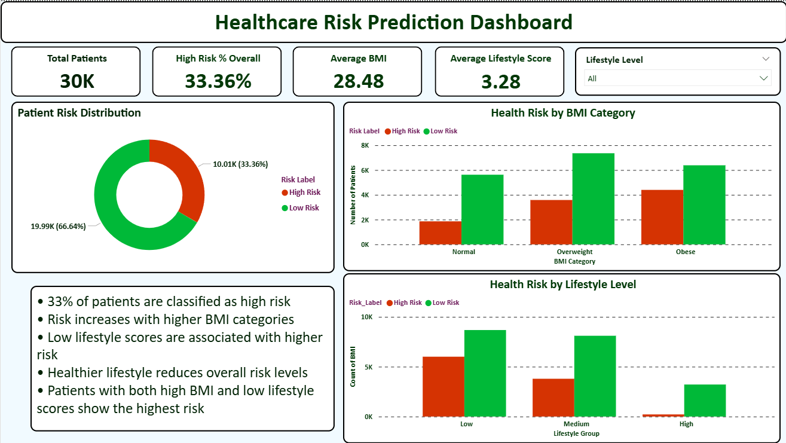

# 🏥 Healthcare Risk Analytics Project

## 📌 Overview

This project focuses on analyzing patient health and lifestyle data to identify key risk factors associated with high-risk patients and build a predictive model for healthcare risk classification.

The project includes:

* Exploratory Data Analysis (EDA)
* Feature Engineering
* Predictive Modeling (Logistic Regression)
* Interactive Power BI Dashboard

---

## 📊 Dashboard Preview

### 🔹 Overview Dashboard



### 🔹 Risk Drivers Analysis


### 🔹 Model Insights & Performance


---

## 📈 Key Insights

* ~33% of patients are classified as high risk
* Risk increases significantly with higher BMI categories
* Low lifestyle scores are strongly associated with higher risk
* Patients with both high BMI and poor lifestyle have the highest risk
* The model achieves:

  * Accuracy: 67.2%
  * Recall: 72% (strong detection of high-risk patients)
  * Precision: 51%
  * F1 Score: 60%

---

## 🤖 Model Performance

* Model: Balanced Logistic Regression
* Strength: High recall → good for identifying high-risk patients
* Limitation: Lower precision → some false positives
* Best Use Case: Risk screening and early intervention

---

## 🗂️ Project Structure

```
Healthcare-Risk-Analytics-Project/
│
├── Dashboards/        # Power BI dashboard + screenshots
├── Dataset/           # Raw and cleaned data
├── Notebooks/         # Jupyter notebooks + HTML reports
├── Proposal/          # Project proposal documents
└── .gitignore
```

---

## 🛠️ Tools & Technologies

* Python (Pandas, NumPy)
* Jupyter Notebook
* Power BI
* Git & GitHub

---

## 🚀 How to Use

1. Open the dataset in the Dataset folder
2. Run the notebook in Notebooks
3. Open the Power BI file in Dashboards
4. Explore interactive visualizations

---

## 💡 Business Impact

This project demonstrates how data analytics can:

* Identify high-risk patients early
* Support preventive healthcare strategies
* Improve decision-making using data-driven insights

---

## 👤 Author

**Siripaiboon Janpetch**
Master’s Student in Data Analytics (UTSA)
